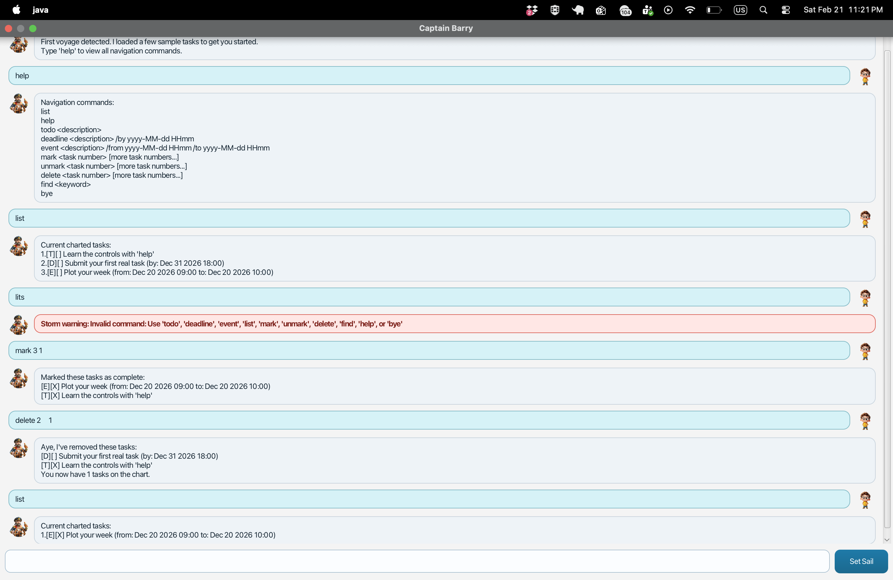

# Captain Barry User Guide

Captain Barry is a desktop chatbot that helps you track tasks quickly using typed commands.

## Quick Start

1. Ensure you have JDK 17 installed.
2. Build/run the app.
3. Type commands in the input box and press Enter (or click `Set Sail`).
4. Type `help` anytime to see command usage.

## Command Summary

- `help` : Show all available commands.
- `list` : Show all tasks.
- `todo <description>` : Add a todo task.
- `deadline <description> /by yyyy-MM-dd HHmm` : Add a deadline task.
- `event <description> /from yyyy-MM-dd HHmm /to yyyy-MM-dd HHmm` : Add an event task.
- `mark <task number> [more task numbers...]` : Mark one or more tasks as done.
- `unmark <task number> [more task numbers...]` : Mark one or more tasks as not done.
- `delete <task number> [more task numbers...]` : Delete one or more tasks.
- `find <keyword>` : Find tasks containing a keyword.
- `bye` : Exit the app.

## Features

### Add a Todo
Use:
`todo read book`

Expected result:
Captain Barry adds the task to your list.

### Add a Deadline
Use:
`deadline submit report /by 2026-03-01 1800`

Expected result:
Captain Barry saves a deadline task with the specified date/time.

### Add an Event
Use:
`event team sync /from 2026-03-01 1400 /to 2026-03-01 1500`

Expected result:
Captain Barry saves an event with start/end times.

### List Tasks
Use:
`list`

Expected result:
Shows all tasks with their index and done status.

### Mark / Unmark Tasks
Use:
- `mark 1`
- `unmark 1 2`

Expected result:
Updates done status for the specified task numbers.

### Delete Tasks
Use:
`delete 2 4`

Expected result:
Removes the specified tasks.

### Find Tasks
Use:
`find report`

Expected result:
Shows only tasks whose description contains `report`.

## Input Rules and Error Handling

- Date/time format must be `yyyy-MM-dd HHmm`.
- Invalid dates (for example, `2026-02-30`) are rejected.
- For `event`, end time must be later than start time.
- Duplicate task numbers in one command are rejected (for example, `mark 1 1`).
- Task numbers must be positive integers.
- Repeated flags are rejected:
  - `deadline` accepts only one `/by`
  - `event` accepts only one `/from` and one `/to`
- Leading/trailing spaces are accepted:
  - ` bye ` works the same as `bye`
- Extra arguments for no-argument commands are rejected:
  - `bye x` is invalid

## Data Storage

- Tasks are saved automatically.
- Data file location: `./data/barry.txt`
- On first run, Captain Barry may preload sample tasks to help you get started.
